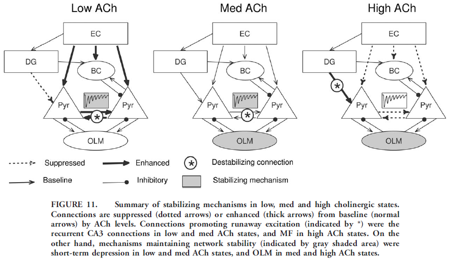

# Intrinsic Mechanisms Stabilize Encoding and Retrieval Circuits Differentially in Hippocampal Network Model

Hummos, A., Franklin Charles, C., & Nair Satish, S. (2014). Intrinsic mechanisms stabilize encoding and retrieval circuits differentially in a hippocampal network model. Hippocampus, 24(12), 1430–1448. https://doi.org/10.1002/hipo.22324

# Paper Summary 

## Abstract

Acetylcholine regulates memory encoding and retrieval by inducing the hippocampus to switch between pattern separation and pattern completion modes. 
* Both (separation and completion) can cause variations in network activity and cause runaway excitation (seizure-like spread). Intrinsic mechanisms exist to prevent run-away seizure-like behaviors. Model is built to what specific mechanisms are involved and, importantly, their mechanism of action.
* The intrinsic mechanisms considered are: spatially organized projections from EC, recurrent connections in CA3, inhibition by BCs, inhibition by OLMs, facilitation/depression in synapses, and neuromodulatory state.
* Findings – see sections below on ‘Results’ and ‘Discussion’.

## Introduction

* Hippocampus is important in memory storage and retrieval. Completion - CA3 region of hippocampus aids in retrieval of memory traces from partial cues or noisy inputs. Separation - DG (dentate gyrus) separates neural representations of similar memories via a different circuit to optimize storage and retrieval
* Causes of instability - CA3 is highly recurrent, leading to instability. Also, the strong projections from DG to CA3 via mossy fibers (MFs, termed ‘detonator synapses’) can also result in runaway excitation.
* ACh – encoding new memories at high cholinergic levels, induced by novelty, altering circuit by lowering synaptic efficacy at recurrent connections in CA3 and by boosting MF synapses from DG to CA3. This allows the network to encode separated representations of current input while reducing interference from previous memories. Separated representations are created in DG, transmitted to CA3
* This study focuses on the role of several intrinsic mechanisms in stabilizing run-away and their differential roles in high and low neuromodulatory states.

## Methods

* Model has networks for entorhinal cortex (EC), DG, CA3. 
* Single Cells
    * CA3 -> Pyramidal cells, Interneurons (BC and OLM)
    * DG -> Granule cells, BC, HIPP cells
    * Cells are Izhikevich formulation, matching various properties found in literature (RMP, threshold, peak AP, current injection responses, frequency adaptation, sag response, rebound spikes)
* Network structure
    * Rat Hippocampus contains ~1.6 million cells, this network was scaled down while maintaining ratios
    * DG = 384 granule, 32 BC and 32 HIPP
    * CA3 = 63 pyramidal, 8 BC and 8 OLM
    * EC = Inputs to performant pathway, projecting to the entire hippocampal formation
    * Perforant path projections follow a lamellar organization across longitudinal axis of hippocampus
        * lateral and posterior parts of EC are connected to dorsal parts of CA3 and DG
        * medial and anterior parts of EC project to ventral parts of CA3 and DG
    * Cells are distributed in 3D space separated into the respective 3 regions (EC, DG, CA3)
    * Dimensions follow rat hippocampus
    * Projections from EC on to pyramidal cells and BC in DG and CA3 followed a lamellar pattern where neurons were most likely to connect to neurons in the center of their longitudinal neighborhood with decreasing probability toward periphery
    * Modeled using Gaussian connection probability function dependent on longitudinal distance between two cells.
    * Mossy Fibers (MF) followed same lamellar pattern but with more limited longitudinal extent
    * Each DG connected to a maximum to two CA3 pyramidal cells (BMTK uses exactly 2?)
    * Projections from DG granule to CA3 BC are diffuse and out-number projection to CA3 pyramidal cells by 10:1 ratio. 
    * DG projections to BC followed Gaussian distribution
    * CA3 recurrent connections reveal no spatial organization, distributed homogenously
    * Dendritic projecting OLM cells are thought to be involved in in feedback inhibitory loops
    * They make more synapses compared to BCs. 
    * BCs have more diffuse axonal arborization with highest connection probability to pyramidal cells in immediate neighborhood, decreasing connection probability toward periphery of axonal arbors.
    * BCs project to neighboring OLM cells
    * Assumed BC projections to pyramidal cells and OLM cells shared same spatial domain
    * OLMs receive reciprocal connections from the same pyramidal cells they projected to
    * Principal cells in DG and CA3 project homogenously to BCs with fixed probability consistent with lack of specific topography reported
    * Network was constructed by generating connections randomly observing restraints above. 10 random initializations were observed and averaged.
* Synaptic Currents
    * Modeled using kinetic modes by Destexhe et al.
    * AMPA, NMDA, GABAA and GABAB
    * CA3 AMPA currents were fastest 
    * MF inputs from DG and slowest for performant path inputs from EC
    * Recurrent CA3 inputs from other pyramidal cells had intermediate values
    * Inhibitory current from OLM had slower dynamics
    * Synaptic weights were assigned in accordance with literature where available
    * MF synapses were adjusted so a train of spikes arriving at the synapse could cause CA3 neuron to fire where a single spike could not.
    * Recurrent CA3 were assigned low initial weight, data shows action potentials have transmission probability of 4% at those synapses
    * Synapses from CA3 pyramidal to interneurons were set higher, 60% success rate
* Long-Term Synaptic Plasticity
    * Granule cells and DG interneurons were adjusted to achieve sparse DG firing
    * GABAergic synapses -> many forms of plasticity exist
        * activation of pre- and postsynaptic neurons in hippocampus lead to LTP if pre and post spikes were 20ms together, LTD if within 50ms and no change if longer
        * depends on activation of post synaptic L-type voltage dependent calcium channels
    * Implemented using a learning rule that used concentration of postsynaptic calcium pool at each synapse
    * At excitatory synapses, calcium entered pools via NMDA receptors, inhibitory -> entered via VCDDs
    * Both, synaptic weight depressed when calcium concertation was above lower threshold and increased if concentration exceeded upper threshold
* Short-Term Synaptic Plasticity
    * Modeled the pronounced short-term facilitation at MF and frequency-dependent synaptic depression reported at CA3 connections
    * Projections from CA1 pyramidal cells to OLM cells and BC cells
    * Inhibitory currents from OLM to pyramidal show no short-term facilitation or depression
    * Inhibitory currents form BC to pyramidal show depression
    * Equations are in section 4.2 and Table S5
* Acetylcholine Effects
    * Acetylcholine activates:
        * muscarinic receptors coupled with a G-protein signaling cascade
        * nicotinic receptors that are fast ionic channels
    * Hippocmpus receives colergenic inputs from septum-diagonal band complex
    * Model had 0 (low), 1 (baseline), 2 (high) level of Ach
    * Synaptic transmission of different pathways were affected by ACh concentration
        * Preforant pathway projections to CA3 suppressed by 50%
        * Recurrent connections in CA3 were suppressed by 85% (Haselmo et al.)
        * Mossy Fiber (MF) transmission enhanced by 49%
    * Modeled effects on synapses:
        * AMPA currents were scaled by ACh value (0,1,2)
        * bACh determined the direction and magnitude of Ach effects on particular synapses
        * Values of bACh for different synapses were set according to experimental results
    * Cholinergic stimulation enhanced cellular excitability and depolarized resting membrane potential of principal cells, eliminated AHP, decreased spike frequency adaptation and induced rhythmic burst activity
    * Muscarinic stimulation of OLM cells depolarized the RMP and lowered spike frequency adaptation and AHP
    * PV-BC express low levels of nicotinic Ach receptors, respond to muscarinic receptor activation with limited RMP depolarization
* Inputs and Data Analysis
    * To test robustness, network was challenged with increasing levels of input from EC
    * Each trial lasted 500ms
* Model Tuning and Validation
    * Experimental literature was used
    * Iterative tuning of parameters performed until behavior matched experimental observations
    * Validation:
        * Ability of model to produce experimental data
        * Ability of model to reproduce a set of experimental observations it was not designed to reproduce
* Model Tuning
    * Adjustment of connection weights and LTP thresholds
    * Followed Hasselmo et al experiments
        * High Ach levels for 5 trials, presenting input patterns for 250ms around 12 Hz
        * After encoding, 10 trials with one additional input change per trial were presented
        * Retrieval trial had low Ach and number of spiking cells were recorded and plotted to create patterns pairwise comparison correlation plot
        * See accompanying document (HummosBanks-bmtk/Hipp_paper_steps.docx)
        * CA3 may still retrieve previously learned memory pattern
        * DG reveal lower correlation relative to input, indicating DG is predisposed to create distinct representations
* Model Validation
    * Averaged results from 10 random initializations to show CA3 outputs in response to probe patterns for retrieval had significantly lower correlation levels to encoded pattern under Ach compared to low Ach levels. DG remained unchanged
* Limitations
    * Input resistance was not modeled
    * Synapses from DG granule cells to CA3 BCs did not have any short-term plasticity

## Results
* Introduction
    * High levels of ACh -> DG formed distinct representations of input, primarily due to large numbers of DG granule cells. High ACh caused granule cells to fire at a higher rate due to more depolarized membrane potential, lower spike frequency adaptation and lower AHP. Combined with prominent short-term facilitation at MF synapses, ACh levels enhance flow of info from DG to CA3. Also Ach suppressed synaptic transmission at inputs from EC to CA3, decreasing interference. Abundant connections from DG to CA3 BCs further increased inhibition on CA3 pyramidal cells reducing activation of previous memories
    * Low levels of ACh, granule cells fired a t a lower rate reducing influence over CA3 pyramidal cells. Also, boosted inputs to CA3 cells from EC and from other CA3 neurons, facilitating retrieval of previously learned patterns
    * Runaway excitation was a common phenomenon, tasked to investigate specific roles of intrinsic mechanism in preventing runaway excitation after turning off plasticity and setting ACh to medium levels.
    * Devised the following method: EC neurons were projected to CA3 at increasing levels of activity over 30 trials. Selected EC neurons were stimulated to fire on AP at the beginning of a trial. Starting with one neuron stimulated during Trial 1, one additional EC neuron received stimulation for each trial until 30 distinct neurons were stimulated during Trial 30. 
* Recurrent Connections Create Seizure-Like Instability
    * DG was turned off and OLM and BC interneurons were disconnected. Short-term depression was removed from recurrent connection synapses. All long-term plasticity was blocked. ACh was set at baseline (medium) level
    * EC neurons were projected to CA3 at increasing levels over 30 trials
    * CA3 population firing rate increased linearly with increasing EC input when recurrent connections were disabled. In contrast population firing rate showed sudden nonlinear increase when recurrent connections were present
    * To quantify the ‘response’ of CA3 neurons, recorded and plotted the level of activity in CA3 via z-scores. If z-score was higher than 2.58 the neuron was considered active.  This showed that low inputs produced little response while high inputs produced an unstable firing pattern.
* BCs Fail to Control Instability
    * First step, to try and control the runaway excitation was to reconnect the BCs in CA3. OLMs remain disconnected. Remember that connections in both directions from BC to pyramidal cells exhibit short-term synaptic depression.
    * BC did not control instability, simply shifted activity to the right, delaying the runaway until further input was introduced. Can you guess why?  See Discussion and notes later.
* OLM Interneurons and Short-Term Depression in Recurrent Connections can Control Instability
    * OLM cells were surprisingly effective at controlling instability. Higher levels of OLM inhibition moved curve for the ratio of active pyramidal cells to linearity, decreasing the slope. Why? 
    * Recruitment of OLM neurons into active pool showed sudden nonlinear jump for high levels of OLM inhibition during the time pyramidal cells showed linear increase
    * Tested effects of short-term depression in recurrent CA3 connections a sole stabilizing mechanism – parameters for which matched experimental recordings of recurrent CA3 connections. Similar to OLM inhibition, simulation revealed higher levels of short-term depression also decreased rate of CA3 pyramidal recruitment below rate of input increase.
    * Activating either OLM inhibition or short-term depression alone at baseline levels that match experimental recordings was not sufficient to reduce rate of activity increase in CA3. Both were needed to manage effectively
* High and Low Cholinergic States Require Different Stabilizing Mechanisms
    * So far – while BCs are incapable of stabilizing CA3 at baseline levels of ACh, both OLM and short-term depression at recurrent connections did effectively control instability. We now study stabilization of the network in both low and high cholinergic states.
    * Re-connected DG with all synapses and mechanisms present
    * Recruitment of CA3 pyramidal cells were evaluated at low and high ACh levels with either OLM inhibition or recurrent connections short-term depression active. This revealed that for low ACh case short-term depression at recurrent connections was the critical mechanism and the effect of OLM was no longer sufficient.  Can you guess why?
    * For high ACh short-term depression at recurrent CA3 connections was ineffective by itself, and OLM cells were necessary to maintain stability
    * Low and High ACh caused increased bursting in CA3
        * High ACh significantly enhanced MF transmission, causing large currents in CA3
    * Ability of OLM cells to contain instability created by CA3 recurrent connections depended on the strength of the synaptic transmission at the recurrent collaterals. Lower ACh reduced cholinergic suppression of the recurrent connections and caused excitatory activity to spread rapidly before OLM inhibition arrived. At baseline ACh OLM cells were able to fire in time to prevent excitation runaway
    * Training with pattern 1 did not significantly affect these results. How much did the various synapses grow after training?
## Discussion
* Develop a more detailed biophysical model than previously reported due to the inclusion of neurophysiological mechanisms. The model also extended previously established distinctions between the low and high cholinergic circuits (Hasselmo et al. 1995) by demonstrating different destabilizing and stabilizing mechanisms in these circuits. An implication of these findings is that different forms of seizure activity could develop in each circuit through unique mechanisms.
* Biologically Constrained Model of Pattern Completion and Separation. Our model extended previous work (see refs) by adding two types of interneurons and short-term synaptic plasticity…and this permitted a more detailed analysis of their role in stabilizing excitatory activity in CA3 during low and high cholinergic states.
* Depressing Synapses Limit Efficacy of BC Interneurons
    * Due to two factors
        * BC-to-pyramidal and pyramidal-to-BC connections displayed short-term synaptic depression
        * Renders BC inhibition less relevant at higher firing rates
        * BCs receive less connections from pyramidal cells and provide fewer connections to pyramidal cells
* Nonlinear Mechanisms Play a Critical Role in Stabilization
    * OLM inhibition was dependent on ACh level
        * Low: failed to stabilize due to rapid spread of excitation through recurrent connections
        * Due to slow dynamics of OLM they arrived too late
        * Baseline: recurrent was relatively suppressed
        * High: highly suppressed, strong input from MF was not a problem
* Two Distinct Circuits in the Hippocampus
    * The encoding and retrieving circuits use the same “hardware” but activity changes based on environment (ACh)
    * Findings suggest that failure of different mechanism might by implicated in seizure-like behavior in hippocampus during different levels of cholinergic states.
    * Model predicts that certain seizures are induced by novelty and others may be by familiarity
    * Intense feeling of familiarity that produces seizures in humans (“déjà vu”)
    * Novelty-induced seizures would be dysfunction of inhibitory interneurons while familiarity would be due to excessive excitatory transmission at recurrent connections.

### USING THE FIGURE BELOW, CAN YOU RETRIEVE FROM MEMORY ALL THE MATERIAL LISTED IN THE PREVIOUS PAGES?

 

----   
*This page is part of a collection of pages on various topics of [computational neuroscience](https://en.wikipedia.org/wiki/Computational_neuroscience). Please direct questions and suggestions to the author Tyler Banks [[website](https://tylerbanks.net)][[github](https://github.com/tjbanks)] at [tyler@tylerbanks.net](mailto:tyler@tylerbanks.net).*